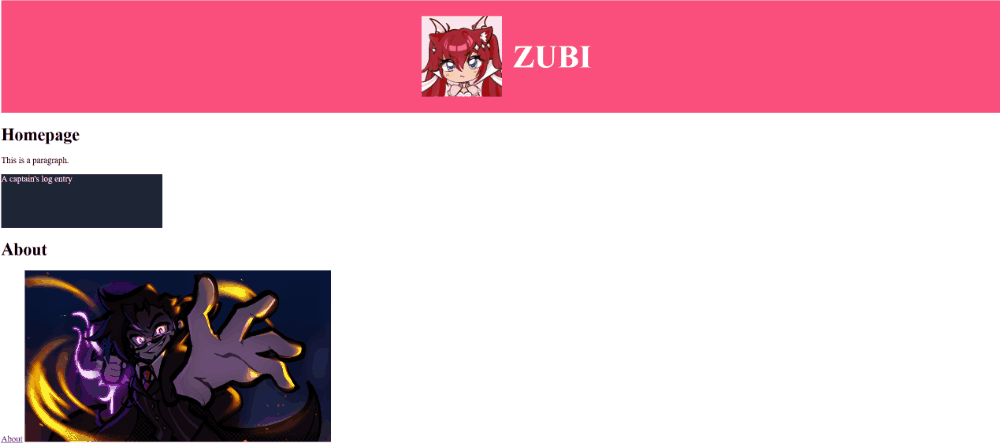

## 
 ✦ 
  *A curious creative looking for her spot in cybersecurity...* 

Nice to meet you! I go by Zubi. I'm a creative ComSci student who loves learning, growing and working together :)

### 🔭 Current Tech Interests
  - Cybersecurity
  - APIs
  - Linux desktop & servers
  - De-Googling & securing my privacy
    
### Languages
  - C#
  - C++
  - Python

<h2 align="center"> ⭐ Completed Project Showcase ⭐ </h2>
  
 <b> Object Oriented Programming Reservation System in C# (Jan. '26)
    <a href="https://github.com/zubiwubi/Object-Oriented-Design-Programming/tree/main">📚 OODP's Repository here!</a></b> 
    
 Using C#, SQLite, Three-Layer-Architecture, Git and Scrum 

     
  
  
 

 
 
<h2 align="center"> 🌱 Ongoing School Projects! (Sep. '26 - Jan. 27) 🌱 </h2>  
  
 <b> 1. Web App. Development (Full-Stack | React, TypeScript, Node.js, C#) </b>
    <!-- <a href="https://github.com/zubiwubi/INF2-WAD-26">📚 Web App.'s Repository here!</a></b> -->
    
 Currently building a secure, front- and backend web application in a team of five using an agile workflow. We will learn how to create responsive UI with client-side routing, integrated a RESTful API with an ORM, and implement JWT authentication for secure user access. 

 
  
  

 
 

 <b> 2. Software Construction & Processing (DevOps | CI/CD Pipelines, Docker & Code Refactoring) </b> 
    <!-- <a href="https://github.com/PieterLandaal/CargoHub_Group3">📚 SCP.'s Repository here!</a></b> -->

 With a team of four, we're currently transforming less-than-stellar Python software into an improved application by implementing automated CI/CD pipelines, Docker containerization, and  testing suites. We have to analyse the given code and then perform refactoring to improve maintainability and secure dependencies. 

 
 
<h2 align="center"> 🌀 Ongoing Personal Projects 🌀 </h2>  
  
 <b> ★. Artist Portfolio Website (Full-Stack | React, TypeScript, Node.js </b>
    <a href="https://github.com/zubiwubi/Artist-Portfolio-Website">📚 Artist Portfolio Website's Repository here!</a></b> 
    
 NOTE: Not a demonstration of my visual design skills!  
    This project serves as a playground I use to experiment with everything regarding TypeScript, REACT and HTML as I follow my lectures and tutorials such as The Odin Project. 

 
  
  

 
<!-- 
 <b> ★. Cybersecurity Selfstudy </b>

 Currently following along with challenges from https://pwn.college/welcome/ & https://www.hackthissite.org/ to gain a greater knowlegde   
 
 -->

## 
 ✦ 

### ✨ Fun Facts ✨
  - I have a bachelor in Game Art, thanks to that I have a deep understanding of design philosophies
  - I have a Japanese Language Proficiency Certificate at A2 level
  - I love fighting games and often engage in community-hosted tournaments
  - I'm a creative at heart, I value human made media & sustainability  

Needless to say, my passion is to learn and grow

## 
 ✦ 

<!--
**zubiwubi/zubiwubi** is a ✨ _special_ ✨ repository because its `README.md` (this file) appears on your GitHub profile.

Here are some ideas to get you started:
  - If you're curious about my Game Art portfolio it can be found here: https://www.artstation.com/zubaydah
- 🔭 I’m currently working on ...
- 🌱 I’m currently learning ...
- 👯 I’m looking to collaborate on ...
- 🤔 I’m looking for help with ...
- 💬 Ask me about ...
- 📫 How to reach me: ...
- 😄 Pronouns: ...
- ⚡ Fun fact: ...
(https://pwn.college/welcome/)
  - APIs
-->
